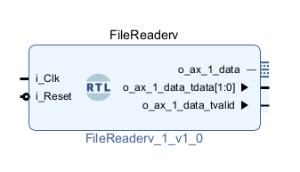
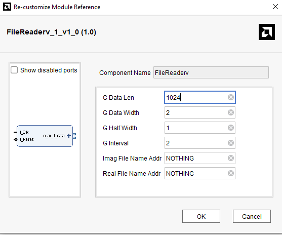
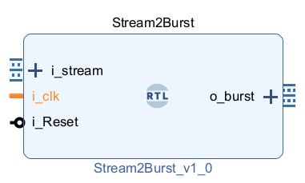
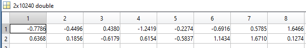
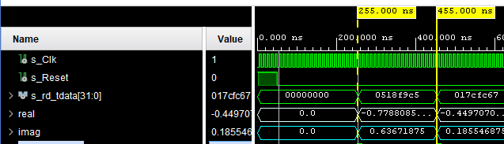
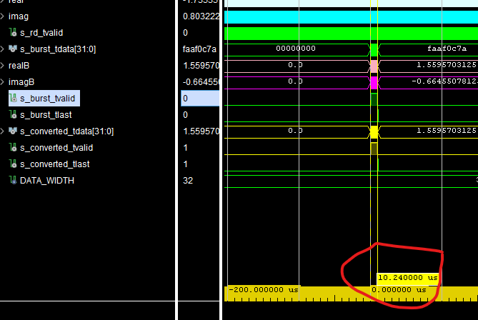
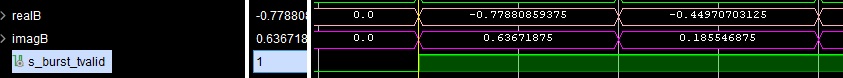
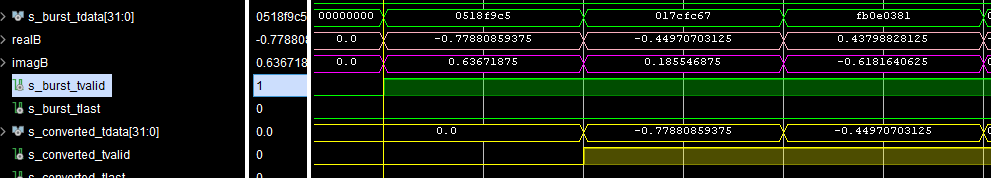

# Testbench Accelerator 
This repository contains VHDL and MATLAB files designed to accelerate VHDL testbench development. Generating complex waveforms directly in VHDL can be challenging; this framework allows you to generate waveforms in MATLAB and seamlessly use them within your Vivado testbenches.

The repository includes VHDL cores that read stimulus files created by MATLAB, feed them to your Unit Under Test (UUT), and write simulation results back to files. These result files can then be analyzed in MATLAB, offering a more intuitive and flexible verification workflow.

A complete test example is provided that automatically builds a Vivado project, allowing you to run the testbench and observe the results firsthand.

## VHDL CORES 
### File Reader core 
This core reads data from files generated by MATLAB and provides a streaming interface to your UUT within a Vivado testbench.
**Block Diagram**<br> 

 <br>

**Port Definition:**
| Port Name  | Description |
| ------------- | ------------- |
| i_Clk  | clock signal  |
| i_Reset  | active high reset signal  |
| o_ax_1_data_tdata  | Output data bus   |
| o_ax_1_data_tvalid  | Valid signal for the output data bus  |

**Configuration Parameters:**<br> 

 <br> 

description of each parameter came in following table: <br>
| config Name  | Description |
| ------------- | ------------- |
| G_DATA_LEN  | Number of data samples to read from file  |
| G_DATA_WIDTH  | Total width of real and imaginary data combined (e.g., if each is 16 bits, set to 32)  |
| G_HALF_WIDTH  | G_DATA_WIDTH / 2   |
| G_INTERVAL  | Initiation interval between data reads (in clock cycles)  |
| Imag File Name Addr  | Path and filename for imaginary part data (e.g., "./someDir/imag.txt")  |

## Stream to Burst 
When your UUT requires burst-mode input, this module collects data from the File Reader at a specified interval and converts it to a burst format compatible with your core.<br>
**Block Diagram:**

 <br>  

this core like other cores have its configa parameters that you can see in the following image:<br> 

 <br>  

list of these configuration parameters came in the following table: 
| Config Name  | Description |
| ------------- | ------------- |
| Burst Len  | Length of burst packet in clock cycles  |
| Data Width  | Width of the input std_logic_vector  |

## File Writer 
This module writes testbench output data to a file whenever your core asserts a valid signal. Its configuration parameters are similar to the File Reader core.

## Fixed-Point Conversion Function
A synthesizable function is provided for converting fixed-point numbers between different formats.

$$
y = convert(x, w1, f1, w2, f2)
$$

**Parameters:**<br>
 * `x`: Input std_logic_vector
 * `w1`: Word length of input
 * `f1`: Fraction length of input
 * `w2`: Word length of output
 * `f2`: Fraction length of output


## Example Testbench
A complete test example is included to demonstrate the workflow. The following configuration is used:

 * **Initiation interval**: 20 clock cycles (File Reader valid signal asserts every 20 cycles)
Data width: 64 bits (16-bit real + 16-bit imaginary)
 * **Fraction length**: 11 bits for both real and imaginary parts
 * **Burst length**: 1024 clock cycles
 * **Fixed-point conversion**: $$fi(x, 1, 16, 11) → fi(y, 1, 32, 14)$$

Example conversion usage:

```c++
s_converted_tdata <= convert(s_burst_tdata(15 DOWNTO 0), 16, 11, 32, 14);
```

## Building the Project
To build the Vivado project:
 1. Open Vivado
 2. Navigate to your build directory in the Tcl console:
   ```python
    cd <build_directory>
   ```
 3. Run the build script:
   ```python
    source ./vivado_build.tcl
   ```
After the project is built, run the provided testbench simulation to verify the functionality and observe the results.

## Workflow Summary

 1. Generate stimuli in MATLAB and save to text files
 2. Use File Reader core to read stimuli in your VHDL testbench
 3. Apply stimuli to UUT (optionally using Stream to Burst Converter)
 4. Capture results using File Writer core
 5. Analyze outputs in MATLAB by reading the generated result files

This approach combines the flexibility of MATLAB for waveform generation and analysis with the power of VHDL simulation in Vivado.

**The testbench output can be visualized in the screenshots below:**

 <br>

 <br>

The image above shows the File Reader output. With the initiation interval parameter set to 20 and a testbench clock period of 5 ns, the valid signal asserts every 20 clock cycles, as observed in the waveform. You can also verify that the values read from the files match the expected testbench data.<br>


 <br>

 <br>
The burst mode operation is shown above. These values can be cross-verified with the original MATLAB data to confirm correct functionality.


## Convert Result
 <br>
